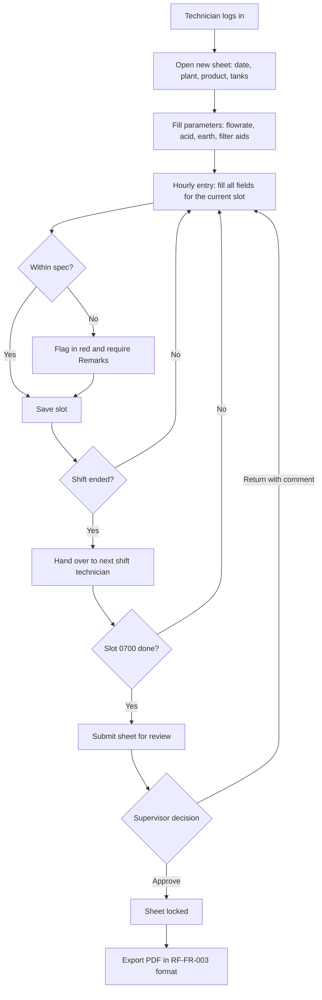
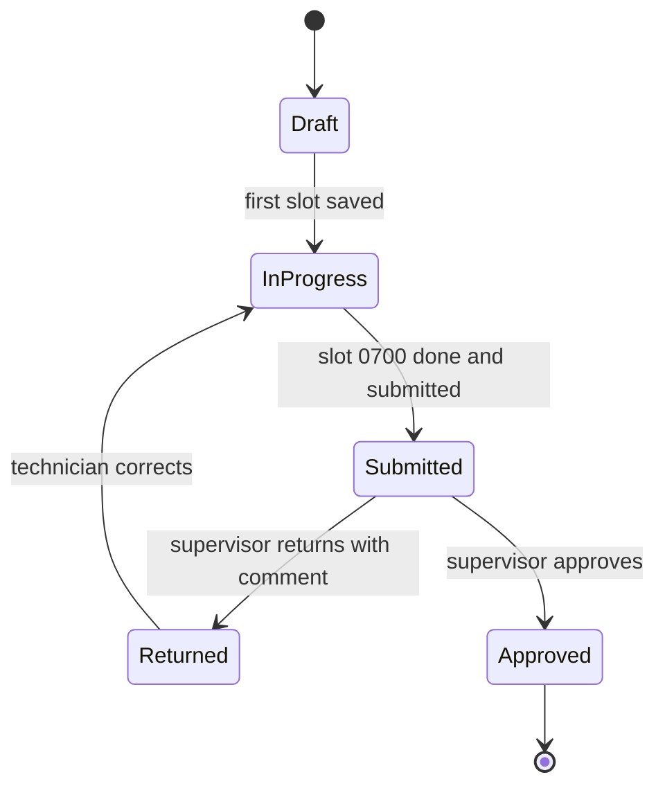
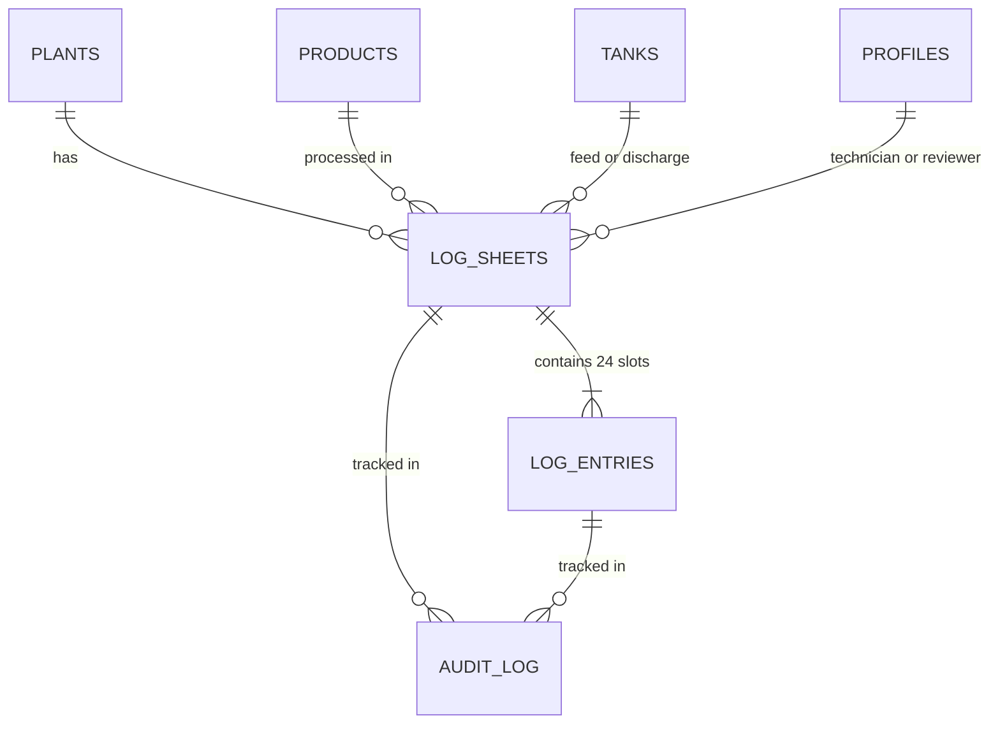

# PRD: Digital Bleaching Process Log (RF-FR-003)

**Product:** Web app replacing the paper *FS/WS Auto Bleaching Process Log Sheet* (Form RF-FR-003, Rev 03), Refinery Department, Lam Soon Edible Oils Sdn Bhd **Stack:** Next.js (frontend) · InsForge (database, auth, storage) **Status:** Draft v0.3 · Confirmed: L/H level, 3 shifts, supervisor approval

**Contents:** Part A Product Requirements · Part B Project Plan · Part C Workflow · Appendix A Technical Reference

---

# Part A: Product Requirements

## 1. Overview

Technicians currently fill this log by hand every hour, 24 hours a day. Paper sheets get lost, handwriting is hard to read, out-of-spec readings are noticed late, and supervisors must check each sheet manually. These pain points are working hypotheses, to be validated with technicians and supervisors in Discovery.

The app digitises the same form with the same fields, so technicians do not need to learn a new process. What changes: instant validation, safe storage, supervisor review, and a PDF export that matches the original form.

**Goals**

1. Fully replace paper RF-FR-003 after a pilot period.
2. Each hourly entry takes under 60 seconds on a tablet.
3. Out-of-spec readings are flagged at the moment of entry.
4. Every record is searchable, filterable and exportable by date, plant and product.

**Non-goals (v1):** direct PLC/SCADA integration, advanced analytics, other refinery forms.

**Success metrics:** at least 98% of hourly slots filled on time; zero lost sheets; supervisor review time down by 50%; paper retired after a 4-week parallel run.

## 2. Form field inventory

Read from the original PDF and verified against its layout. This is the basis of the data schema.

### 2.1 Sheet header

| Field on form | Type | Notes |
| --- | --- | --- |
| Form No / Rev No | Fixed: RF-FR-003 / 03 | Stored on every sheet for revision control |
| Date | Date | Start date of the sheet (see 2.4) |
| Plant | Select (master data) |  |
| Product | Select (master data) |  |
| Tech 1st / 2nd / 3rd Shift | User (3 slots) | One technician per shift |
| Feed Tank | Select (master data) |  |
| Discharge Tank | Select (master data) |  |

### 2.2 Parameter block (above the table)

| Group | Fields and units |
| --- | --- |
| **Input flowrate** | MT/HR · MT/DAY |
| **Citric/Phosphoric acid** | Mm · Cm/Hr · % |
| **Bleaching earth** | Type · Setting · Min (%) · Kgs/Day |
| **Filter aids** | Type: 1, 2 · Quantity: 1, 2 |

### 2.3 Hourly table (24 rows, 0800 to 0700)

| Column | Sub-heading | Input type | Rule |
| --- | --- | --- | --- |
| Time | Hrs | Fixed slot | 0800…2400, 0100…0700 |
| Flowrate | MT/HR · Set | Number | Set value |
| Acid Dosage | √ | Checkmark |  |
| HE Temp | °C | Number | Range **70–115 °C** |
| Earth Dosage | √ | Checkmark |  |
| Bleacher Level | L/H | Toggle: **L** or **H** |  |
| Bleacher Vacuum | Min. | Number (mmHg) | Minimum **600 mmHg** |
| Niagara Filter | N60-1/2/3/4 | Select one of 4 |  |
| Changing Filter | Time | Time (HH:mm) | Empty if no change |
| Quality: FFA | % | Decimal number |  |
| Quality: Colour | R · Y | Two numbers | Red and Yellow |
| Remarks |  | Free text |  |

### 2.4 Details the design must handle

- **One sheet spans two calendar dates.** Slots 0–15 (0800–2300) fall on the sheet date; slot 16 (2400) and slots 17–23 (0100–0700) fall on the next day. The system stores `slot_index` 0–23 and derives every timestamp with one rule and no branching: `sheet_date + 08:00 + slot_index hours`. Slot 16 therefore lands exactly on 00:00 of the next day.
- **Three shifts of 8 hours:** Shift 1 = 0800–1500, Shift 2 = 1600–2300, Shift 3 = 2400–0700 (slots 0–7, 8–15, 16–23).
- The paper form has **no signature or approval area**. The supervisor review flow is an addition, confirmed as wanted.

## 3. Users and roles

| Role | Main tasks | Permissions |
| --- | --- | --- |
| **Technician** | Fill header and hourly entries for own shift | Create sheets; edit own shift's entries only |
| **Supervisor** | Review sheets; return or approve | Read all; comment; return / approve |
| **Manager / QA** | Audit, reports, export | Read all; export |
| **Admin** | Manage users and master data | Full access |

## 4. Functional requirements

**P0: must have (MVP)**

- Login and role-based access.
- Create a sheet (header + parameter block); block duplicates for the same date + plant + product.
- 24-slot entry screen with every column in 2.3; the current slot is highlighted.
- Real-time validation: HE Temp 70–115 °C, Vacuum ≥ 600 mmHg. Failing values are flagged and Remarks becomes mandatory.
- Auto-save per slot, showing who entered it and when.
- Sheet list with filters (date, plant, product, status).
- Submit sheet for review.

**P1: should have**

- Supervisor review: comment, return, approve, lock sheet.
- PDF export (A4 landscape) matching RF-FR-003.
- Offline mode (PWA): entries saved locally and synced when the network returns.
- Overdue slot indicator.
- Full audit log (who changed what, old and new value).

**P2: later**

- Trend charts for HE Temp, vacuum, FFA, colour per batch.
- CSV/Excel export; overdue-slot notifications.
- Copy header parameters from the previous sheet.
- Dark theme for control-room use.

## 5. Data model (InsForge / PostgreSQL)

| Table | Key fields |
| --- | --- |
| `profiles` | id, name, role, active |
| `plants`, `products`, `tanks` | id, name; `tanks.kind` = feed / discharge |
| `log_sheets` | id, sheet_date, plant_id, product_id, feed_tank_id, discharge_tank_id, tech_s1, tech_s2, tech_s3, form_no, form_rev, input_mt_hr, input_mt_day, acid_type, acid_mm, acid_cm_hr, acid_pct, earth_type, earth_setting, earth_min_pct, earth_kgs_day, aid1_type, aid1_qty, aid2_type, aid2_qty, status, submitted_at, reviewed_by, reviewed_at, review_note |
| `log_entries` | id, sheet_id, slot_index (0–23), flowrate_set, acid_dosage_ok, he_temp_c, earth_dosage_ok, bleacher_level (L/H), vacuum_mmhg, niagara_filter, filter_change_time, ffa_pct, colour_r, colour_y, remarks, out_of_spec (jsonb), entered_by, entered_at |
| `audit_log` | id, table, record_id, field, old_value, new_value, user_id, at |

**Constraints:** `UNIQUE(sheet_id, slot_index)`; `UNIQUE(sheet_date, plant_id, product_id)`. Out-of-range values are saved and flagged in `out_of_spec`, not rejected, because real readings must always be recorded.

**Security:** Postgres Row Level Security so technicians can only edit their own shift's entries, and `Approved` sheets are writable by Admin only. Confirm RLS and auth support in the current InsForge docs during setup.

## 6. UI/UX direction

**Context:** used on the plant floor, on landscape tablets, with busy hands and varying light. The design must be clear, fast and undecorated.

**Principles**

1. **Keep the table technicians already know.** The main screen stays a 24-hour grid like the paper form, but the current row opens into a large entry panel. That is the one deliberate focal point; everything else stays quiet and orderly.
2. **Touch targets of 48 px or more.** Numeric keypad for number fields; segmented buttons (not small dropdowns) for L/H and Niagara filter.
3. **Colour carries meaning, not decoration.** Red only for out-of-spec, green for completed slots, amber for overdue.
4. **Plain-language copy.** Buttons name the real action ("Save slot", "Submit for review"); errors say what went wrong and how to fix it.
5. **Avoid generic AI-looking design:** no decorative gradients, no identical rounded cards everywhere, no cream-and-terracotta or black-and-neon-green palettes, no spaced ALL-CAPS label above every heading, no entrance animation on every section.

**Starting tokens (adjustable)**

| Role | Value |
| --- | --- |
| Background | `#F5F6F4` |
| Ink / text | `#1B2A2E` |
| Primary accent (oil gold) | `#B8860B` |
| Lines and secondary | `#5E6E73` |
| In spec | `#2F7D52` |
| Out of spec | `#C0392B` |
| Overdue | `#D97706` |

**Typography:** *Bricolage Grotesque* for headings; *Instrument Sans* for body and data, with `font-variant-numeric: tabular-nums` so number columns align.

**Key screens**

- **Sheet list:** filters on top, one row per sheet with status.
- **Sheet:** collapsible header, a 24-slot rail showing done / overdue / out-of-spec, and the entry panel for the selected slot.
- **Review:** read-only view with out-of-spec cells highlighted, plus Approve / Return buttons.
- **Admin:** users and master data.

**Quality floor:** responsive on tablet and phone, visible keyboard focus, WCAG AA contrast, respects `prefers-reduced-motion`.

## 7. Technical architecture

- **Frontend:** Next.js (App Router), TypeScript, Tailwind, React Hook Form + Zod (validation rules shared with the server).
- **Backend:** InsForge: PostgreSQL, Auth, Storage (exported PDFs), RLS.
- **PDF:** generated server-side from sheet data in an A4 landscape layout matching RF-FR-003.
- **PWA:** service worker and local queue for offline entry.
- **Environments:** dev, staging, production; daily database backups.

**Non-functional:** slot save under 1 second; available 24/7; every change traceable; retention period to match company records policy (to be confirmed).

## 8. Open questions

1. **Acid block "Mm / Cm/Hr / %":** what does each measure (e.g. pump stroke length)? Is the acid on a sheet Citric or Phosphoric (a select)?
2. **Bleaching earth "Setting" and "Min":** units for Setting, and the exact meaning of Min (shown on the form with a % and with Kgs/Day).
3. **Colour (R/Y) and FFA:** scale and spec limits, if any.
4. **Master data:** full valid lists of plants, products and tanks.
5. **Approver and retention:** who approves a sheet, and how long records must be kept.
6. **Future:** can any value (temperature, vacuum) come from the control system later?
7. **Product or tank change mid-day:** the form has only one Product, Feed Tank and Discharge Tank per sheet. Does a change happen during a day? If yes, the unique rule `(sheet_date, plant_id, product_id)` would split one day into two half-empty sheets, so the model needs a segment or change-over record.
8. **Document control:** Rev 03 has no signature or approval area. Ask QA or document control whether adding approval means the printed form becomes Rev 04, and whether the "ISO-compliant" PDF claim needs their sign-off.
9. **Process terms:** confirm the feed oil type, whether this is a fractionation line, and the colour scale (Lovibond or other).

---

# Part B: Project Plan

| Phase | Duration | Deliverables |
| --- | --- | --- |
| **0. Discovery** | 1 week | Open questions answered; pain-point hypotheses validated; shadow technicians; master data lists; wireframes |
| **1. MVP** | 3 weeks | Auth, master data, create sheet, 24-slot entry, validation, list and filters, submit |
| **2. Review and export** | 2 weeks | Supervisor review, sheet locking, RF-FR-003 PDF, audit log |
| **3. Offline and pilot** | 2 weeks | PWA offline mode; parallel run with paper on one plant; collect feedback |
| **4. Rollout** | 1–2 weeks | All plants, training, retire paper |

**Roughly 9–10 weeks end to end.**

**Risks and mitigations**

- Weak Wi-Fi on the plant floor → offline mode (P1) and per-slot auto-save.
- Technicians resist a new system → keep a paper-like layout, short training, pilot first.
- Form revised to Rev 04 → schema and PDF carry `form_rev`, so older sheets stay valid.
- Data entered late or in bulk → overdue indicators; timestamps show when each slot was actually entered.

---

# Part C: Workflow

## C1. Sheet workflow

## C2. Sheet status lifecycle

Approved sheets are locked. Only an Admin can change them, and every change is written to the audit log. PDF export is an action available on any Approved sheet and can be repeated, so it is not a status.

## C3. Shift schedule

| Shift | Slots | Hours | Technician field |
| --- | --- | --- | --- |
| 1st | 0–7 | 0800–1500 | Tech 1st Shift |
| 2nd | 8–15 | 1600–2300 | Tech 2nd Shift |
| 3rd | 16–23 | 2400–0700 | Tech 3rd Shift |

Each technician edits only their own shift's slots. At handover, the incoming technician sees the previous shift's last readings and any flagged items first.

---

# Appendix A: Technical Reference

## A1. Process context (to confirm with the plant)

General palm-oil refining knowledge, used only to explain the form. Oil is heated through the heat exchanger (HE), dosed with citric or phosphoric acid, mixed with bleaching earth in the bleacher under vacuum, then filtered through one of four Niagara filters into the discharge tank. FFA and colour are checked hourly. Items in section 8 (feed oil type, line type, colour scale) are not on the form and stay unconfirmed until the plant answers.

## A2. Entity relationships

Database rules: `UNIQUE(sheet_id, slot_index)` with `CHECK (slot_index BETWEEN 0 AND 23)`; out-of-spec values are always saved and flagged in `out_of_spec`, with Remarks mandatory.

## A3. Failure modes and design responses

| Failure mode | Real risk on the plant | Design response |
| --- | --- | --- |
| Wi-Fi drops near steel tanks | Latest hourly data lost; cannot submit | Offline-first PWA: save to local storage first, sync queue when network returns |
| Shift handover gap | Next technician starts while the previous shift's last slot is empty | Handover view of the previous shift's 8 slots with overdue badges |
| Accidental taps (oily or gloved hands) | Wrong value picked; form closed unsaved | 48 px targets, numeric keypad, confirm dialog when leaving with unsaved changes |
| Unauthorised edits to past records | FFA or colour data altered | Role-based access plus RLS; lock on Approved; admin changes written to the audit log |