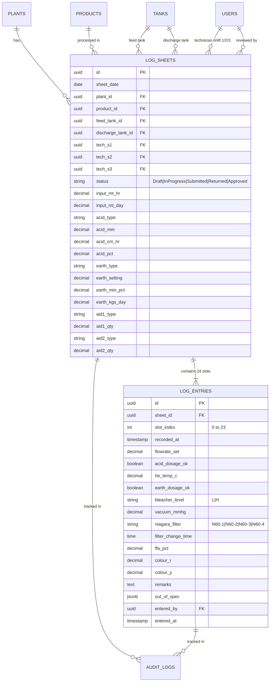
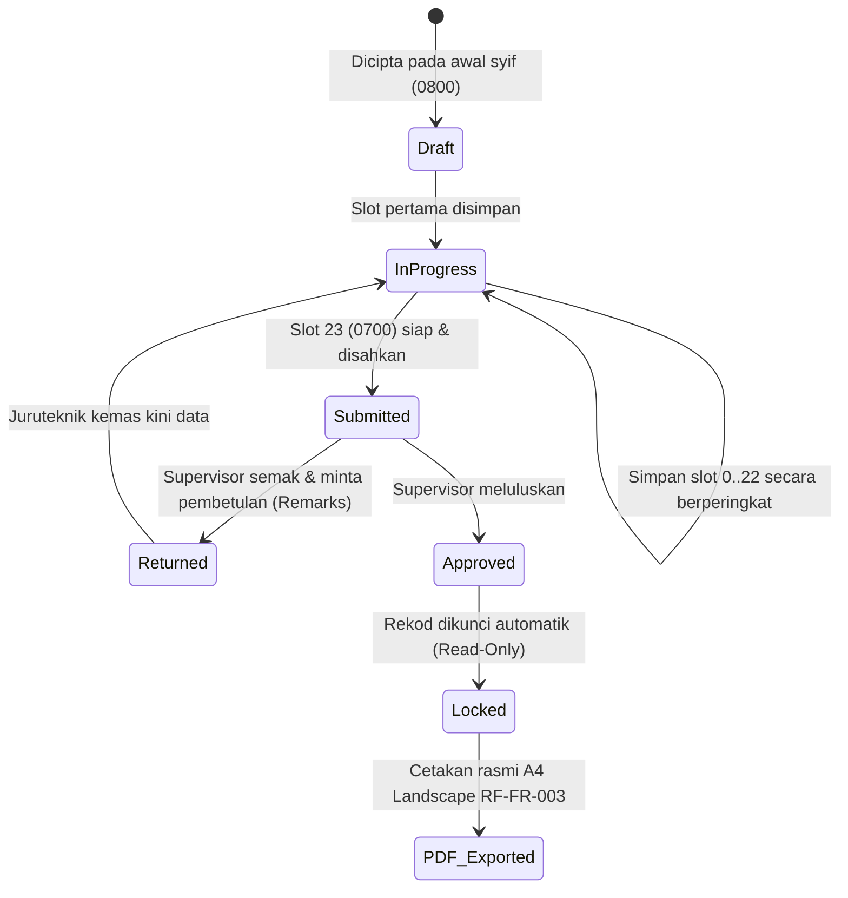

# Penyelidikan & Analisis Senibina Mendalam: Digital Bleaching Process Log (RF-FR-003)

**Projek:** Aplikasi Web & Tablet PWA untuk *FS/WS Auto Bleaching Process Log Sheet* (Borang RF-FR-003, Rev 03)  
**Entiti Kilang:** Jabatan Penapisan (Refinery Department), Lam Soon Edible Oils Sdn Bhd / Nisshin Process Log  
**Stack Utama:** Next.js (App Router), TypeScript, Tailwind CSS, PostgreSQL / InsForge, Offline PWA (IndexedDB), React-PDF Engine.

---

## 1. Analisis Domain & Keperluan Operasi Kilang Minyak Sawit

### 1.1 Latar Belakang Proses Penapisan (Bleaching Process)
Dalam proses penapisan minyak sawit (Refining of Palm Oil / Fractionation):
- Minyak mentah (CPO/RBDPO feedstock) dipam melalui penukar haba (**Heat Exchanger / HE**) dan dicampur dengan asid sitrik atau asid fosforik (**Degumming Acid**) untuk mengikat gam/fosfatida.
- Minyak kemudian dialirkan ke dalam tangki **Bleacher** di bawah keadaan vakum tinggi (minimum 600 mmHg) bersama serbuk tanah peluntur (**Bleaching Earth**) bagi menyerap pigmen warna, sisa getah, dan ion logam.
- Campuran minyak dan tanah peluntur ditapis melalui salah satu penapis bertekanan (**Niagara Filter N60-1 hingga N60-4**) untuk menghasilkan minyak peluntur yang jernih sebelum dihantar ke tangki pelepasan (**Discharge Tank**).
- Kualiti diuji setiap jam: Free Fatty Acids (**FFA %**) dan Warna (**Colour Red & Yellow** pada skala Lovibond).

### 1.2 Masalah Sebenar Sistem Kertas RF-FR-003
1. **Kertas Hilang / Kotor / Basah:** Persekitaran loji penapis mempunyai minyak, habuk tanah peluntur, dan kelembapan.
2. **Kelewatan Mengesan Sisihan (Out-of-Spec Latency):** Suhu HE lari (<70°C atau >115°C) atau vakum jatuh (<600 mmHg) hanya disedari oleh penyelia selepas syif tamat apabila menyemak borang kertas.
3. **Penyelarasan Syif (Handover Friction):** Operasi 24 jam berterusan memerlukan 3 syif bertukar maklumat tanpa kehilangan data slot jam sebelumnya.
4. **Beban Audit & Semakan:** Penyelia menghabiskan masa berjam-jam menyemak borang fizikal dan mengarkib secara manual.

---

## 2. Invarian Data & Model Skema (`data-modeling-discipline`)

### 2.1 Entiti & Hubungan (Entity Relationship)

### 2.2 Invarian Skema Yang Wajib Dikuatkuasakan di Peringkat Database:
1. **Integriti Lembaran Unik:**
   `UNIQUE(sheet_date, plant_id, product_id)`
   *(Satu loji dan satu produk hanya boleh mempunyai 1 lembaran aktif pada satu-satu tarikh).*
2. **Integriti Slot 24-Jam:**
   `UNIQUE(sheet_id, slot_index)` di mana `slot_index CHECK (slot_index BETWEEN 0 AND 23)`.
3. **Logik Merentas Tengah Malam (Cross-Midnight Calendar Handling):**
   - Slot 0 hingga 15 (0800 hingga 2300, termasuk 2400) jatuh pada `sheet_date`.
   - Slot 16 hingga 23 (0100 hingga 0700) jatuh pada `sheet_date + INTERVAL '1 day'`.
   - Timestamp sebenar dihasilkan secara deterministik: `actual_slot_timestamp = calculate_slot_time(sheet_date, slot_index)`.
4. **Peraturan Data Luar Spesifikasi (Out-of-Spec Discipline):**
   - Suhu HE normal: **70.0°C – 115.0°C**.
   - Vakum Bleacher normal: **≥ 600.0 mmHg**.
   - **Peraturan Kritis:** Nilai luar julat **TIDAK BOLEH DITOLAK (Do Not Reject/Block Save)** kerana data loji fizikal mesti dicatat dengan jujur. Sebaliknya, sistem menandakan nilai tersebut dalam `out_of_spec` JSONB dan menguatkuasakan input `remarks` menjadi **wajib**.

---

## 3. Analisis Mod Kegagalan & Keselamatan Operasi Kilang (`think-before-coding`)

| Mod Kegagalan (Failure Mode) | Risiko Sebenar di Loji | Penyelesaian & Reka Bentuk Sistem |
| :--- | :--- | :--- |
| **Wi-Fi Terputus di Tangki Keluli** | Data jam terkini hilang, juruteknik tidak dapat submit | **PWA Offline-First (Dexie/IndexedDB):** Auto-simpan ke storan lokal tablet dahulu, queue outbox akan sync automatik sebaik sahaja rangkaian kembali. |
| **Handover Syif Tergantung** | Juruteknik Syif 2 memulakan kerja tetapi Syif 1 belum mengisi slot jam 1500 | Paparan handover visual khas: Memaparkan status 8 slot Syif 1 secara ringkas, menandakan slot tertunggak (*Overdue Slot Badge*). |
| **Tekan Butang Tak Sengaja (Jari Kotor/Minyak)** | Nilai tersilap pilih, borang terkeluar tanpa simpan | Touch target minimum 48px, numeric virtual keypad atas skrin, dialog pengesahan jika cuba keluar semasa ada perubahan yang belum disimpan. |
| **Penyuntingan Rekod Lalu Tanpa Izin** | Manipulasi data kualiti FFA/Colour | **RBAC + RLS:** Juruteknik hanya boleh menyunting slot dalam syif mereka sendiri. Apabila status borang bertukar ke `Approved`, keseluruhan rekod dikunci (*immutable lock*). Sebarang ubahan admin direkod ke dalam `audit_log`. |

---

## 4. Reka Bentuk UI/UX Berstandard Tinggi (`frontend-design` & `interaction-design`)

### 4.1 Prinsip Reka Bentuk (Bukan Templat AI Generik)
- **Tablet Landscape First:** Dioptimumkan untuk paparan tablet (10-12 inci) yang dipasang pada stesen kawalan loji atau dibawa oleh juruteknik.
- **Dwi-Paparan Berfokus (Dual-Mode Overview & Fast Entry):**
  1. **24-Hour Schedule Rail & Table:** Meniru rupa borang RF-FR-003 asal supaya juruteknik tidak perlu mempelajari semula format yang mereka kenali selama ini.
  2. **Active Slot Quick Drawer / Entry Modal:** Apabila slot semasa diklik, satu panel entri pantas dibuka dengan butang besar, keypad nombor responsif, dan petunjuk had toleransi serta-merta. Sasaran pengisian: **bawah 45-60 saat**.
- **Warna Semantik Industri:**
  - Latar Belakang: `#F5F6F4` (Light Industrial) / `#0B0F19` (Dark CCR Control Room Mode)
  - Oil Gold Accent: `#B8860B` (Elemen identiti kilang minyak)
  - In-Spec: `#2F7D52` (Emerald Green)
  - Out-of-Spec Alarm: `#C0392B` (Rose Red)
  - Overdue Warning: `#D97706` (Amber Alert)
- **Tipografi:**
  - Tajuk & Penunjuk Utama: *Bricolage Grotesque* / *Inter*
  - Data Numerik, Masa, Nilai Telemetri: *Instrument Sans* atau *JetBrains Mono* dengan `font-variant-numeric: tabular-nums` (memastikan lajur nombor sejajar tepat).

---

## 5. Kitaran Hayat Borang (State Machine) & Aliran Kelulusan

---

## 6. Penjanaan PDF Seiras Borang Asal (RF-FR-003 Rev 03)
Eksport PDF mestilah memenuhi piawaian dokumen ISO loji:
- Format: **A4 Landscape**.
- Header lengkap dengan logo syarikat, tajuk *"FS/WS Auto Bleaching Process Log Sheet"*, nombor borang *RF-FR-003 Rev 03*.
- Susunan parameter degumming acid, bleaching earth, filter aids di bahagian atas.
- Grid 24 baris dengan format masa 0800 hingga 0700.
- Ruangan tandatangan / pengesahan elektronik (Nama Juruteknik Syif 1, 2, 3 dan Tarikh/Masa Kelulusan Penyelia).
